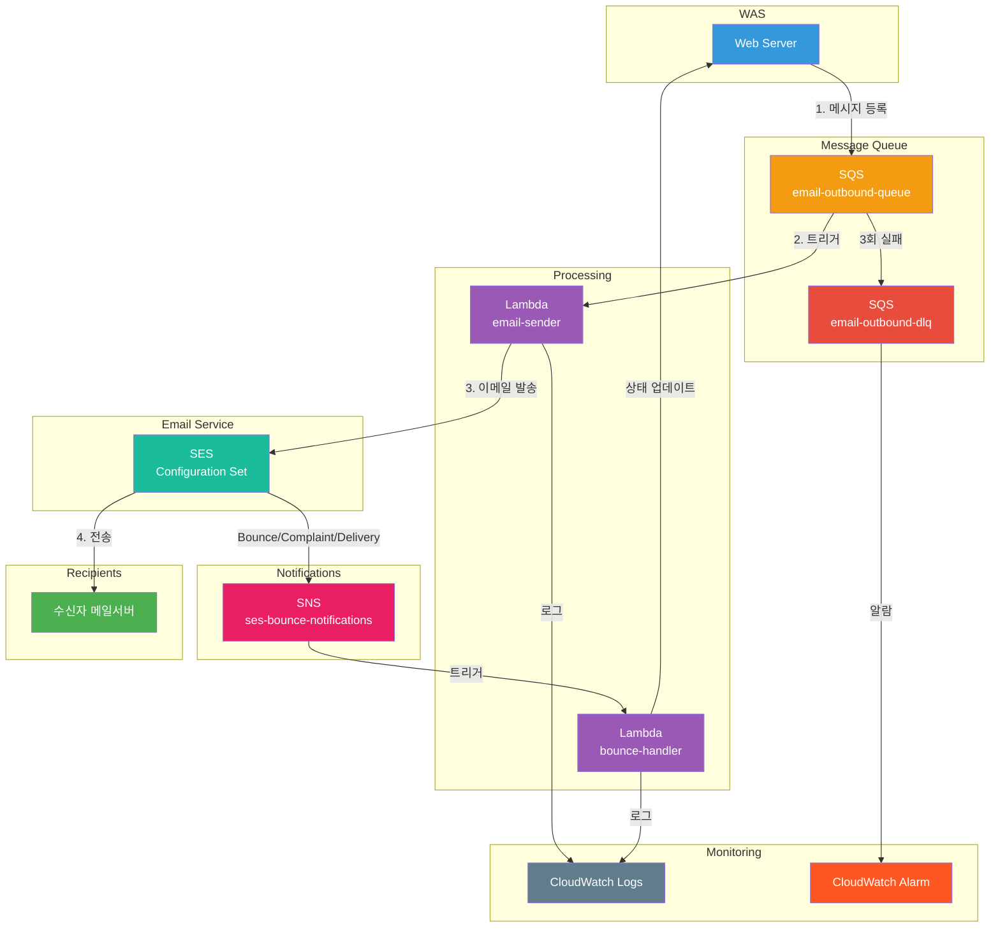

# 📧 SES Email Service

[](https://aws.amazon.com/)
[](https://aws.amazon.com/lambda/)
[](https://aws.amazon.com/sqs/)
[](https://aws.amazon.com/ses/)
[](https://www.python.org/)
[](https://aws.amazon.com/serverless/sam/)

> 서버리스 기반 비동기 이메일 발송 시스템

## 배경
Cold-Email 대량발송 및 추적 솔루션을 제작하던 중 AWS SES API를 웹서버 에서 직접 호출하는 방식으로 구현하였더니 다음과 같은 문제점이 발생하였음.


- **SES Rate Limit**: 초당 14개 발송 한도로 인한 Throttling 에러
- **동기 처리 지연**: 대량 발송 시 사용자 응답 대기 시간 증가
- **실패 처리 부재**: 발송 실패 시 재시도 로직 없음
- **상태 추적 불가**: Bounce, Complaint 등 이메일 상태 파악 어려움

이를 해결하기 위해 SQS + Lambda 기반의 비동기 이메일 발송 시스템을 구축함.

## Architecture


## Project Structure

```
ses-email-service/
├── src/
│   ├── email_sender/
│   │   └── app.py          # 이메일 발송 Lambda
│   └── bounce_handler/
│       └── app.py          # Bounce/Complaint 처리 Lambda
├── template.yaml           # SAM 템플릿
├── samconfig.toml          # SAM 배포 설정
└── README.md
```

## 주요 흐름

### 이메일 발송
1. 웹서버 에서 이메일 발송 요청을 SQS에 등록
2. Lambda(email-sender)가 SQS 메시지를 받아 SES로 발송
3. 실패 시 최대 3회 재시도 후 DLQ로 이동

### 이벤트 처리
1. SES에서 Bounce/Complaint/Delivery 이벤트 발생
2. SNS를 통해 Lambda(bounce-handler)로 전달
3. 이메일 상태 업데이트 및 필요 시 블랙리스트 처리

## Tech Stack
|구성요소|	기술|	용도|
|------|-----|------|
|Queue	|Amazon SQS	|메시지 대기열 및 DLQ|
|Compute	|AWS Lambda	|이메일 발송 및 이벤트 처리|
|Email	|Amazon SES	|이메일 발송|
|Notification|	Amazon SNS	|SES 이벤트 전달|
|Monitoring|	CloudWatch|	로그 및 알람|
|IaC	|AWS SAM	|인프라 코드 관리|


## Configuration
| 항목 | 값 | 설명 |
|------|-----|------|
| Lambda 동시성 | 10 | SES Rate Limit 내 안정적 처리 |
| SQS 배치 크기 | 1 | 실패 시 개별 재시도 |
| 최대 재시도 | 3회 | DLQ 이동 전 재시도 횟수 |
| Visibility Timeout | 60초 | Lambda timeout × 6 |

## Setup

### Windows 환경 개발자

자세한 설정 가이드는 [SETUP_WINDOWS.md](SETUP_WINDOWS.md)를 참고하세요.

**빠른 시작:**
```powershell
# 1. Python 3.12 설치 (pyenv-win)
pyenv install 3.12.0
pyenv local 3.12.0

# 2. 가상환경 생성
python -m venv venv
.\venv\Scripts\Activate.ps1

# 3. 의존성 설치
pip install --upgrade pip
pip install -r requirements.txt
pip install -r requirements-dev.txt  # 개발/테스트용

# 4. 환경 변수 설정
Copy-Item .env.example .env
code .env  # 이메일 주소 설정
```

## Deployment

### Prerequisites

- [AWS CLI](https://docs.aws.amazon.com/cli/latest/userguide/cli-chap-getting-started.html) configured
- [SAM CLI](https://docs.aws.amazon.com/serverless-application-model/latest/developerguide/install-sam-cli.html) installed
- SES domain verified
- Python 3.12

### Deploy

```bash
sam build
sam deploy --guided
```

## Test

### 환경 설정

```bash
# 1. 의존성 설치
pip install -r requirements.txt

# 2. 환경 변수 파일 생성
cp .env.example .env

# 3. .env 파일 편집
# - TEST_FROM_EMAIL: SES 인증된 발신자 이메일
# - TEST_TO_EMAIL: 수신자 이메일
# - SQS_QUEUE_URL: sam deploy 후 확인
```

### 테스트 메시지 전송

```bash
# 정상 발송
python email_test/send_test_message.py --type normal

# 필수 필드 누락 (즉시 삭제, DLQ 안감)
python email_test/send_test_message.py --type missing-email-id
python email_test/send_test_message.py --type missing-from

# 미인증 이메일 (MessageRejected, DLQ 안감)
python email_test/send_test_message.py --type unverified-email

# Dry-run 모드
python email_test/send_test_message.py --type normal --dry-run
```

### SQS Message Format

```json
{
    "email_id": "unique-email-id",
    "from": "sender@yourdomain.com",
    "to": "recipient@example.com",
    "subject": "Email Subject",
    "body": "<html>Email content</html>"
}
```

## Monitoring

| 로그 | 위치 |
|------|------|
| 발송 로그 | `/aws/lambda/{env}-email-sender` |
| 이벤트 처리 로그 | `/aws/lambda/{env}-bounce-handler` |

**CloudWatch Alarm**: DLQ 메시지 ≥ 1 시 알림

## Notes

- SES Sandbox 모드: 인증된 이메일로만 발송 가능
- Production 전환: AWS SES 콘솔에서 요청 필요
- Rate Limit 증가: AWS Support 티켓 생성

